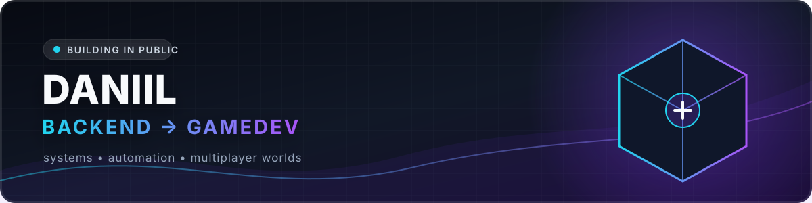

<div align="center">



### Backend-разработчик, который движется в GameDev

Создаю прикладные backend-системы, Telegram-продукты и постепенно переношу этот
опыт в разработку игровых механик, интерфейсов и многопользовательских миров.

<p>
  <a href="https://github.com/Weakmafaka?tab=repositories"></a>
  <a href="https://sbox.game/minimalinc/mrp"></a>
</p>

</div>

## Обо мне

Я Даниил. Мне нравится превращать идею в работающий продукт: продумывать
архитектуру, собирать понятный пользовательский сценарий, подключать внешние
сервисы и доводить проект до развёртывания.

Мой основной практический опыт сейчас связан с Python, асинхронными Telegram-
ботами, PostgreSQL, API-интеграциями и Docker. Следующий большой вектор —
разработка игр на C# и s&box: от отдельных компонентов до цельных игровых систем.

```text
продуктовая идея → архитектура → код → тестирование → запуск → развитие
```

## 🎮 Курс на GameDev

Сейчас я целенаправленно развиваюсь в геймдеве и работаю над
[MinimalRP](https://sbox.game/minimalinc/mrp) — крупным roleplay-проектом для
[s&box](https://sbox.game/dev/doc/) на базе Source 2.

В проекте я занимаюсь игровыми системами, архитектурой, интерактивным миром и
логикой на C#. MinimalRP помогает мне глубже разбираться в компонентном подходе,
сценах, UI и особенностях многопользовательской разработки.

> **Текущий фокус:** создавать не только надёжные сервисы, но и игровые миры,
> в которых техническая архитектура напрямую работает на опыт игрока.

## 🚀 Публичные проекты

Ниже представлены только репозитории, которые открыты для публичного просмотра.

<table>
<tr>
<td width="50%" valign="top">

### 🎭 [Mafia](https://github.com/Weakmafaka/Mafia)

Telegram-игра в классическую «Мафию» с комнатами, распределением ролей, ночными
ходами, дневным голосованием и системой рейтинга.

**Что внутри:** игровая FSM, приватные действия игроков, ведущий раундов,
PostgreSQL и контейнерное развёртывание.

`Python` `aiogram` `PostgreSQL` `Docker`

</td>
<td width="50%" valign="top">

### 🧸 [Yantarik](https://github.com/Weakmafaka/Yantarik)

Telegram-помощник для родителей с развивающим контентом, мини-играми,
AI-помощником и подписной моделью.

**Что внутри:** платежи через YooKassa, webhooks, роли, контентная система,
объектное хранилище и управляемая выдача материалов.

`Python` `aiogram` `YooKassa` `S3`

</td>
</tr>
</table>

> Публичный доступ к коммерческим проектам предоставлен для знакомства с кодом
> в рамках портфолио. Условия использования указаны в лицензии каждого проекта.

## 🧰 Технологии и инструменты

<div align="center">

**Backend и данные**


**Продукты и инфраструктура**


**GameDev**


</div>

## Что мне интересно

- проектирование игровых механик и систем взаимодействия;
- backend для продуктов с реальными пользователями;
- асинхронная обработка событий и интеграции;
- автоматизация рутинных процессов;
- надёжное развёртывание и поддержка проектов.

---

<div align="center">

### От сервисов, которые работают, — к мирам, в которых хочется остаться.

[GitHub](https://github.com/Weakmafaka) · [MinimalRP](https://sbox.game/minimalinc/mrp)

</div>
